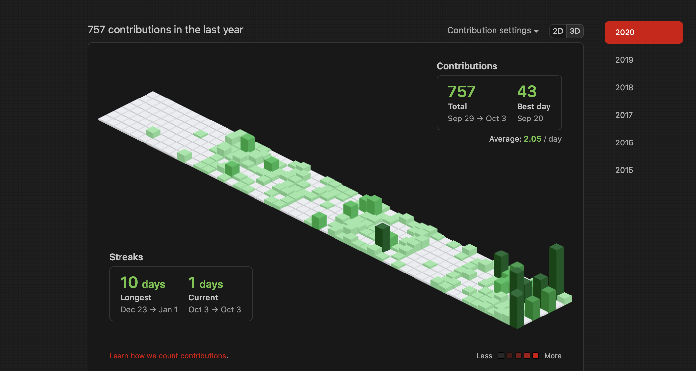

# GITHUB ISOMETRIC SAFARI

To make the github streaks look like building blocks 

Its built as an extension and the XCode project is in the folder ../safari.

The extension is in its development stages and will be sandboxed and be available as a full extension soon.

Built from the orignal Repo: https://github.com/jasonlong/isometric-contributions

 

To contribute, check this: 
 

